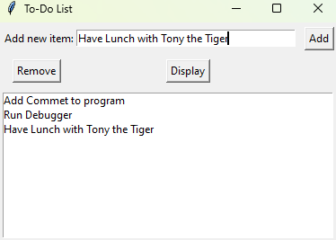

# Simple To-Do List Program

This is a simple Python script that allows you to create and manage a to-do list while the program is running. It provides a command-line interface for adding, removing, and listing tasks.

## Features

- Add tasks to the to-do list.
- Remove tasks from the to-do list.
- List all tasks in the to-do list.
- Visual representation of a to-do list.

## Requirements

- Python 3.x

- 
